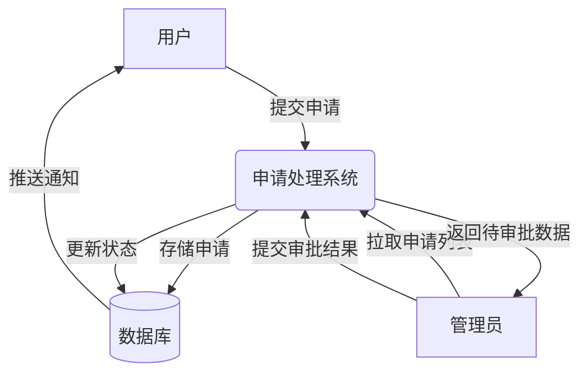

# 库表设计

```sql
-- ----------------------------
-- 1. 用户表
-- ----------------------------
CREATE TABLE IF NOT EXISTS user (
    id           BIGINT AUTO_INCREMENT COMMENT 'id' PRIMARY KEY,
    userAccount  VARCHAR(256)                           NOT NULL COMMENT '账号',
    userPassword VARCHAR(512)                           NOT NULL COMMENT '密码',
    userName     VARCHAR(256)                           NULL COMMENT '用户昵称',
    userRealName VARCHAR(64)							NULL COMMENT '用户实际姓名'
    userIdCardNumber VARCHAR(64)						NULL COMMENT '用户实际身份证号'
    userAvatar   VARCHAR(1024)                          NULL COMMENT '用户头像',
    userProfile  VARCHAR(512)                           NULL COMMENT '用户简介',
    userRole     VARCHAR(256) DEFAULT 'ROLE_USER'       NOT NULL COMMENT '用户角色：USER/ADMIN/BAN',
    createTime   DATETIME     DEFAULT CURRENT_TIMESTAMP NOT NULL COMMENT '创建时间',
    updateTime   DATETIME     DEFAULT CURRENT_TIMESTAMP NOT NULL ON UPDATE CURRENT_TIMESTAMP COMMENT '更新时间',
    isDelete     TINYINT      DEFAULT 0                 NOT NULL COMMENT '是否删除'
) COMMENT '用户' COLLATE = utf8mb4_unicode_ci;

-- ----------------------------
-- 2. 楼栋表
-- ----------------------------
CREATE TABLE IF NOT EXISTS buildings (
    id            INT AUTO_INCREMENT PRIMARY KEY,
    buildingName  VARCHAR(50) UNIQUE NOT NULL COMMENT '楼栋名称/编号',
    address       VARCHAR(100)       NULL COMMENT '地理位置',
    createTime    DATETIME DEFAULT CURRENT_TIMESTAMP COMMENT '创建时间'
) ENGINE=InnoDB DEFAULT CHARSET=utf8mb4 COMMENT='楼栋信息';

-- ----------------------------
-- 3. 房产表
-- ----------------------------
CREATE TABLE IF NOT EXISTS properties (
    id           INT AUTO_INCREMENT PRIMARY KEY,
    buildingId   INT           NOT NULL COMMENT '楼栋ID',
    unit         VARCHAR(20)   NOT NULL COMMENT '单元号',
    roomNumber   VARCHAR(20)   NOT NULL COMMENT '房号',
    area         DECIMAL(10,2) NULL COMMENT '建筑面积',
    ownerId      BIGINT		   NULL COMMENT '拥有者Id'
    ownerIdentity VARCHAR(32)  NULL COMMENT '拥有者身份证号'
    createTime   DATETIME DEFAULT CURRENT_TIMESTAMP COMMENT '创建时间',
    FOREIGN KEY (buildingId) REFERENCES buildings(id)
) ENGINE=InnoDB DEFAULT CHARSET=utf8mb4 COMMENT='房产信息';

-- ----------------------------
-- 4. 用户-房产关联表
-- ----------------------------
CREATE TABLE IF NOT EXISTS user_property (
    id          BIGINT AUTO_INCREMENT PRIMARY KEY,
    userId      BIGINT       NOT NULL COMMENT '用户ID',
    propertyId  INT          NOT NULL COMMENT '房产ID',
    isOwner     TINYINT(1) DEFAULT 0 COMMENT '是否为主业主',
    createTime  DATETIME   DEFAULT CURRENT_TIMESTAMP COMMENT '关联时间',
    UNIQUE KEY unique_user_property (userId, propertyId),
    FOREIGN KEY (userId) REFERENCES user(id),
    FOREIGN KEY (propertyId) REFERENCES properties(id)
) ENGINE=InnoDB DEFAULT CHARSET=utf8mb4 COMMENT='用户-房产关联';

-- ----------------------------
-- 5. 设施表
-- ----------------------------
CREATE TABLE IF NOT EXISTS facilities (
    id             INT AUTO_INCREMENT PRIMARY KEY,
    facilityName   VARCHAR(50)   NOT NULL COMMENT '设施名称',
    facilityType   ENUM('gym', 'meeting_room', 'pool', 'other') NOT NULL COMMENT '类型',
    location       VARCHAR(100)  NULL COMMENT '位置',
    capacity       INT           NULL COMMENT '容量',
    description    TEXT          NULL COMMENT '描述',
    createTime     DATETIME DEFAULT CURRENT_TIMESTAMP COMMENT '创建时间'
) ENGINE=InnoDB DEFAULT CHARSET=utf8mb4 COMMENT='小区设施';

-- ----------------------------
-- 6. 公告表
-- ----------------------------
CREATE TABLE IF NOT EXISTS notices (
    id            BIGINT AUTO_INCREMENT PRIMARY KEY,
    title         VARCHAR(100)  NOT NULL COMMENT '标题',
    content       TEXT          NOT NULL COMMENT '内容',
    publishTime   DATETIME DEFAULT CURRENT_TIMESTAMP COMMENT '发布时间',
    expireTime    DATETIME      NULL COMMENT '过期时间',
    publisherId   BIGINT        NOT NULL COMMENT '发布者ID（管理员）',
    createTime    DATETIME DEFAULT CURRENT_TIMESTAMP COMMENT '创建时间',
    FOREIGN KEY (publisherId) REFERENCES user(id)
) ENGINE=InnoDB DEFAULT CHARSET=utf8mb4 COMMENT='小区公告';

-- ----------------------------
-- 7. 账单表
-- ----------------------------
CREATE TABLE IF NOT EXISTS bills (
    id             BIGINT AUTO_INCREMENT PRIMARY KEY,
    propertyId     INT             NOT NULL COMMENT '房产ID',
    billType       ENUM('property_fee', 'water', 'electricity', 'other') NOT NULL COMMENT '费用类型',
    amount         DECIMAL(10,2)   NOT NULL COMMENT '金额',
    dueDate        DATE            NOT NULL COMMENT '截止日期',
    paymentStatus  ENUM('unpaid', 'paid', 'overdue') DEFAULT 'unpaid' COMMENT '缴费状态',
    createTime     DATETIME DEFAULT CURRENT_TIMESTAMP COMMENT '创建时间',
    paidAt         DATETIME        NULL COMMENT '缴费时间',
    FOREIGN KEY (propertyId) REFERENCES properties(id)
) DEFAULT CHARSET=utf8mb4 COMMENT='费用账单';

-- ----------------------------
-- 8. 报修申请表
-- ----------------------------
CREATE TABLE IF NOT EXISTS repair_order (
    id                 BIGINT AUTO_INCREMENT PRIMARY KEY,
    userId             BIGINT          NOT NULL COMMENT '报修用户ID',
    propertyId         INT             NOT NULL COMMENT '报修房产ID',
    problemDescription TEXT            NOT NULL COMMENT '问题描述',
    status             ENUM('pending', 'processing', 'completed', 'cancelled') DEFAULT 'pending' COMMENT '状态',
    createTime         DATETIME        DEFAULT CURRENT_TIMESTAMP COMMENT '创建时间',
    updateTime         DATETIME        DEFAULT CURRENT_TIMESTAMP ON UPDATE CURRENT_TIMESTAMP COMMENT '更新时间',
    processedBy        BIGINT          NULL COMMENT '处理人ID（管理员）',
    completionTime     DATETIME        NULL COMMENT '完成时间',
    FOREIGN KEY (userId) REFERENCES user(id),
    FOREIGN KEY (propertyId) REFERENCES properties(id),
    FOREIGN KEY (processedBy) REFERENCES user(id)
) ENGINE=InnoDB DEFAULT CHARSET=utf8mb4 COMMENT='报修申请';

-- ----------------------------
-- 9. 投诉建议表
-- ----------------------------
CREATE TABLE IF NOT EXISTS complaint_suggestion (
    id               BIGINT AUTO_INCREMENT PRIMARY KEY,
    userId           BIGINT          NOT NULL COMMENT '提交用户ID',
    content          TEXT            NOT NULL COMMENT '内容',
    type             ENUM('complaint', 'suggestion') NOT NULL COMMENT '类型',
    status           ENUM('received', 'processing', 'resolved', 'closed') DEFAULT 'received' COMMENT '状态',
    createTime       DATETIME        DEFAULT CURRENT_TIMESTAMP COMMENT '创建时间',
    updateTime       DATETIME        DEFAULT CURRENT_TIMESTAMP ON UPDATE CURRENT_TIMESTAMP COMMENT '更新时间',
    handlerId        BIGINT          NULL COMMENT '处理人ID（管理员）',
    responseContent  TEXT            NULL COMMENT '回复内容',
    responseTime     DATETIME        NULL COMMENT '回复时间',
    FOREIGN KEY (userId) REFERENCES user(id),
    FOREIGN KEY (handlerId) REFERENCES user(id)
) ENGINE=InnoDB DEFAULT CHARSET=utf8mb4 COMMENT='投诉建议';

-- ----------------------------
-- 10. 访客表
-- ----------------------------
CREATE TABLE IF NOT EXISTS visitor (
    id               BIGINT AUTO_INCREMENT PRIMARY KEY,
    userId           BIGINT          NOT NULL COMMENT '被访用户ID',
    visitorName      VARCHAR(50)     NOT NULL COMMENT '访客姓名',
    idNumber         VARCHAR(18)     NULL COMMENT '身份证号',
    visitReason      VARCHAR(200)    NULL COMMENT '访问原因',
    visitTime        DATETIME        NOT NULL COMMENT '预计访问时间',
    duration         INT             NULL COMMENT '预计时长（小时）',
    approvalStatus   ENUM('unapproved', 'approved', 'rejected') DEFAULT 'unapproved' COMMENT '审批状态',
    approvedBy       BIGINT          NULL COMMENT '审批人ID（管理员）',
    approvalTime     DATETIME        NULL COMMENT '审批时间',
    passCode         VARCHAR(20)     NULL COMMENT '电子通行证',
    createTime       DATETIME        DEFAULT CURRENT_TIMESTAMP COMMENT '创建时间',
    FOREIGN KEY (userId) REFERENCES user(id),
    FOREIGN KEY (approvedBy) REFERENCES user(id)
) ENGINE=InnoDB DEFAULT CHARSET=utf8mb4 COMMENT='访客管理';

-- ----------------------------
-- 11. 设施预订表
-- ----------------------------
CREATE TABLE IF NOT EXISTS facility_booking (
    id               BIGINT AUTO_INCREMENT PRIMARY KEY,
    userId           BIGINT          NOT NULL COMMENT '预订用户ID',
    facilityId       INT             NOT NULL COMMENT '设施ID',
    bookingTime      DATETIME        NOT NULL COMMENT '预订时间',
    duration         INT             NOT NULL COMMENT '时长（小时）',
    status           ENUM('pending', 'confirmed', 'cancelled', 'used') DEFAULT 'pending' COMMENT '状态',
    createTime       DATETIME        DEFAULT CURRENT_TIMESTAMP COMMENT '创建时间',
    approvedBy       BIGINT          NULL COMMENT '审批人ID（管理员）',
    approvalTime     DATETIME        NULL COMMENT '审批时间',
    FOREIGN KEY (userId) REFERENCES user(id),
    FOREIGN KEY (facilityId) REFERENCES facilities(id),
    FOREIGN KEY (approvedBy) REFERENCES user(id)
) ENGINE=InnoDB DEFAULT CHARSET=utf8mb4 COMMENT='设施预订';

-- ----------------------------
-- 12. 电梯表
-- ----------------------------
CREATE TABLE IF NOT EXISTS elevators (
    id                INT AUTO_INCREMENT PRIMARY KEY,
    buildingId        INT             NOT NULL COMMENT '楼栋ID',
    elevatorNumber    VARCHAR(10)     NOT NULL COMMENT '电梯编号',
    status            ENUM('normal', 'fault', 'maintenance') DEFAULT 'normal' COMMENT '运行状态',
    lastMonitoredTime DATETIME        NULL COMMENT '最后监测时间',
    faultDescription  TEXT            NULL COMMENT '故障描述',
    createTime        DATETIME DEFAULT CURRENT_TIMESTAMP COMMENT '创建时间',
    FOREIGN KEY (buildingId) REFERENCES buildings(id)
) ENGINE=InnoDB DEFAULT CHARSET=utf8mb4 COMMENT='电梯信息';

-- ----------------------------
-- 13. 电梯监测记录表
-- ----------------------------
CREATE TABLE IF NOT EXISTS elevator_monitor_log (
    id                BIGINT AUTO_INCREMENT PRIMARY KEY,
    elevatorId        INT             NOT NULL COMMENT '电梯ID',
    status            ENUM('normal', 'fault', 'maintenance') DEFAULT 'normal' COMMENT '运行状态',
    monitorTime       DATETIME        DEFAULT CURRENT_TIMESTAMP COMMENT '监测时间',
    faultDescription  TEXT            NULL COMMENT '故障描述',
    handledBy         BIGINT          NULL COMMENT '处理人ID（管理员）',
    handleTime        DATETIME        NULL COMMENT '处理时间',
    FOREIGN KEY (elevatorId) REFERENCES elevators(id),
    FOREIGN KEY (handledBy) REFERENCES user(id)
) ENGINE=InnoDB DEFAULT CHARSET=utf8mb4 COMMENT='电梯监测记录';

-- ----------------------------
-- 14. 消防设施表
-- ----------------------------
CREATE TABLE IF NOT EXISTS fire_facilities (
    id                  INT AUTO_INCREMENT PRIMARY KEY,
    facilityType        ENUM('fire_extinguisher', 'smoke_detector', 'fire_hydrant', 'other') NOT NULL COMMENT '类型',
    location            VARCHAR(100)  NOT NULL COMMENT '位置',
    lastInspectionTime  DATETIME      NULL COMMENT '上次巡检时间',
    nextInspectionDue   DATETIME      NULL COMMENT '下次巡检截止时间',
    status              ENUM('normal', 'needs_inspection', 'faulty') DEFAULT 'normal' COMMENT '状态',
    createTime          DATETIME DEFAULT CURRENT_TIMESTAMP COMMENT '创建时间'
) ENGINE=InnoDB DEFAULT CHARSET=utf8mb4 COMMENT='消防设施';

-- ----------------------------
-- 15. 消防设施巡检表
-- ----------------------------
CREATE TABLE IF NOT EXISTS fire_facility_inspection (
    id                  BIGINT AUTO_INCREMENT PRIMARY KEY,
    facilityId          INT             NOT NULL COMMENT '消防设施ID',
    inspectorId         BIGINT          NOT NULL COMMENT '巡检人ID（管理员）',
    inspectionTime      DATETIME        NOT NULL COMMENT '巡检时间',
    status              ENUM('normal', 'needs_inspection', 'faulty') DEFAULT 'normal' COMMENT '状态',
    remarks             TEXT            NULL COMMENT '备注',
    nextInspectionDue   DATETIME        NULL COMMENT '下次巡检截止时间',
    FOREIGN KEY (facilityId) REFERENCES fire_facilities(id),
    FOREIGN KEY (inspectorId) REFERENCES user(id)
) ENGINE=InnoDB DEFAULT CHARSET=utf8mb4 COMMENT='消防设施巡检';

-- ----------------------------
-- 16. 能耗表
-- ----------------------------
CREATE TABLE IF NOT EXISTS energy_consumptions (
    id                BIGINT AUTO_INCREMENT PRIMARY KEY,
    propertyId        INT             NOT NULL COMMENT '房产ID',
    energyType        ENUM('electricity', 'water') NOT NULL COMMENT '能耗类型',
    consumption       DECIMAL(10,2)   NOT NULL COMMENT '用量',
    measurementTime   DATETIME        NOT NULL COMMENT '测量时间',
    createTime        DATETIME DEFAULT CURRENT_TIMESTAMP COMMENT '创建时间',
    FOREIGN KEY (propertyId) REFERENCES properties(id)
) ENGINE=InnoDB DEFAULT CHARSET=utf8mb4 COMMENT='能耗记录';

-- ----------------------------
-- 17. 能耗阈值表
-- ----------------------------
CREATE TABLE IF NOT EXISTS energy_thresholds (
    id                INT AUTO_INCREMENT PRIMARY KEY,
    propertyId        INT             NULL COMMENT '房产ID（NULL为全局阈值）',
    energyType        ENUM('electricity', 'water') NOT NULL COMMENT '能耗类型',
    thresholdValue    DECIMAL(10,2)   NOT NULL COMMENT '阈值',
    createTime        DATETIME DEFAULT CURRENT_TIMESTAMP COMMENT '创建时间',
    FOREIGN KEY (propertyId) REFERENCES properties(id)
) ENGINE=InnoDB DEFAULT CHARSET=utf8mb4 COMMENT='能耗阈值';

-- ----------------------------
-- 18. 应急预案表
-- ----------------------------
CREATE TABLE IF NOT EXISTS emergency_plans (
    id                   INT AUTO_INCREMENT PRIMARY KEY,
    planType             ENUM('fire', 'earthquake', 'flood', 'other') NOT NULL COMMENT '预案类型',
    description          TEXT            NULL COMMENT '预案描述',
    activationCondition  TEXT            NULL COMMENT '启动条件',
    steps                TEXT            NULL COMMENT '应急步骤',
    buildingId           INT             NULL COMMENT '适用楼栋ID（NULL为全局预案）',
    createTime           DATETIME DEFAULT CURRENT_TIMESTAMP COMMENT '创建时间',
    FOREIGN KEY (buildingId) REFERENCES buildings(id)
) ENGINE=InnoDB DEFAULT CHARSET=utf8mb4 COMMENT='应急预案';

-- ----------------------------
-- 19. 应急预案启动记录表
-- ----------------------------
CREATE TABLE IF NOT EXISTS emergency_plan_activation (
    id                   BIGINT AUTO_INCREMENT PRIMARY KEY,
    planId               INT             NOT NULL COMMENT '应急预案ID',
    activatorId          BIGINT          NOT NULL COMMENT '启动人ID（管理员）',
    activationTime       DATETIME        DEFAULT CURRENT_TIMESTAMP COMMENT '启动时间',
    status               ENUM('active', 'resolved', 'cancelled') DEFAULT 'active' COMMENT '状态',
    description          TEXT            NULL COMMENT '启动描述',
    resolutionTime       DATETIME        NULL COMMENT '解决时间',
    resolutionNotes      TEXT            NULL COMMENT '解决备注',
    FOREIGN KEY (planId) REFERENCES emergency_plans(id),
    FOREIGN KEY (activatorId) REFERENCES user(id)
) ENGINE=InnoDB DEFAULT CHARSET=utf8mb4 COMMENT='应急预案启动记录';

-- ----------------------------
-- 20. 疏散路线表
-- ----------------------------
CREATE TABLE IF NOT EXISTS evacuation_routes (
    id                INT AUTO_INCREMENT PRIMARY KEY,
    buildingId        INT             NOT NULL COMMENT '楼栋ID',
    routeDescription  TEXT            NULL COMMENT '路线描述',
    mapUrl            VARCHAR(200)    NULL COMMENT '路线图URL',
    keyPoints         TEXT            NULL COMMENT '关键点（如安全出口）',
    createTime        DATETIME DEFAULT CURRENT_TIMESTAMP COMMENT '创建时间',
    FOREIGN KEY (buildingId) REFERENCES buildings(id)
) ENGINE=InnoDB DEFAULT CHARSET=utf8mb4 COMMENT='疏散路线';

-- ----------------------------
-- 21. 救援资源表
-- ----------------------------
CREATE TABLE IF NOT EXISTS rescue_resources (
    id                 INT AUTO_INCREMENT PRIMARY KEY,
    resourceType       ENUM('fire_extinguisher', 'first_aid_kit', 'emergency_light', 'other') NOT NULL COMMENT '资源类型',
    location           VARCHAR(100)  NOT NULL COMMENT '位置',
    quantity           INT           NOT NULL COMMENT '数量',
    responsiblePerson  VARCHAR(50)   NULL COMMENT '负责人',
    lastCheckedTime    DATETIME      NULL COMMENT '上次检查时间',
    createTime         DATETIME DEFAULT CURRENT_TIMESTAMP COMMENT '创建时间'
) ENGINE=InnoDB DEFAULT CHARSET=utf8mb4 COMMENT='救援资源';

-- ----------------------------
-- 22. 能耗异常预警表
-- ----------------------------
CREATE TABLE IF NOT EXISTS energy_alerts (
    id                BIGINT AUTO_INCREMENT PRIMARY KEY,
    propertyId        INT             NOT NULL COMMENT '房产ID',
    energyType        ENUM('electricity', 'water') NOT NULL COMMENT '能耗类型',
    alertType         ENUM('high_consumption', 'abnormal_fluctuation') NOT NULL COMMENT '预警类型',
    alertValue        DECIMAL(10,2)   NOT NULL COMMENT '预警值',
    thresholdValue    DECIMAL(10,2)   NOT NULL COMMENT '阈值',
    alertTime         DATETIME        DEFAULT CURRENT_TIMESTAMP COMMENT '预警时间',
    isHandled         TINYINT(1)      DEFAULT 0 COMMENT '是否处理',
    handledBy         BIGINT          NULL COMMENT '处理人ID（管理员）',
    handleTime        DATETIME        NULL COMMENT '处理时间',
    handleNotes       TEXT            NULL COMMENT '处理备注',
    createTime        DATETIME DEFAULT CURRENT_TIMESTAMP COMMENT '创建时间',
    FOREIGN KEY (propertyId) REFERENCES properties(id),
    FOREIGN KEY (handledBy) REFERENCES user(id)
) ENGINE=InnoDB DEFAULT CHARSET=utf8mb4 COMMENT='能耗异常预警';

-- ----------------------------
-- 索引优化
-- ----------------------------
CREATE INDEX idx_user_property ON user_property(userId, propertyId);
CREATE INDEX idx_repair_order_user ON repair_order(userId);
CREATE INDEX idx_complaint_user ON complaint_suggestion(userId);
CREATE INDEX idx_visitor_user ON visitor(userId);
CREATE INDEX idx_facility_booking_user ON facility_booking(userId);
CREATE INDEX idx_notice_publish_time ON notices(publishTime);
CREATE INDEX idx_bill_property ON bills(propertyId);
CREATE INDEX idx_elevator_building ON elevators(buildingId);
CREATE INDEX idx_fire_facility_location ON fire_facilities(location);
CREATE INDEX idx_emergency_plan_type ON emergency_plans(planType);
CREATE INDEX idx_energy_consumption_time ON energy_consumptions(measurementTime);
CREATE INDEX idx_energy_alert_time ON energy_alerts(alertTime);
```


## 职责划分


**用户**: 

- 登录

- 注册

- 申请访问(日期，理由)

- 公告查看

- 上传房产信息

  > 需要房产信息
  >
  > - 查询账单
  > - 缴费
  > - 保修申请/查看
  > - 投诉
  > - 申请小区设施

**管理员**: 

- 登陆注册
- (用户基本功能)
- 处理保修申请
- 处理投诉建议
- 管理用户信息
- 管理访客记录(上传/查看/同意审批)
- 管理设施使用申请(查看/同意(拒绝)审批)
- 公告管理(发布/删除/修改)


###  通用审批流程



#### 用户API

- `submit**Request()`

- `listMy**SubmitVOPage()`

#### 管理员API

- `listSubmit**RequestPage()`
- `review**Request()`

#### model

`**SubmitRequest extend PageRequest` 

